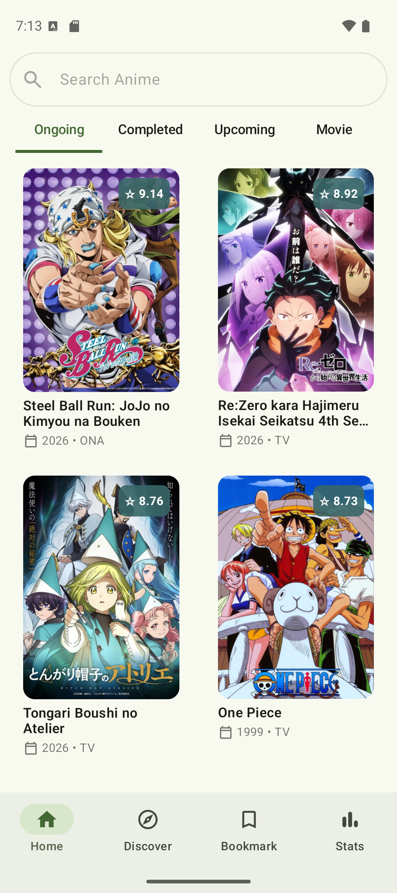
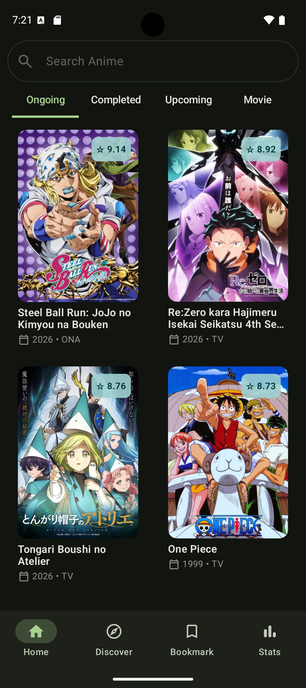
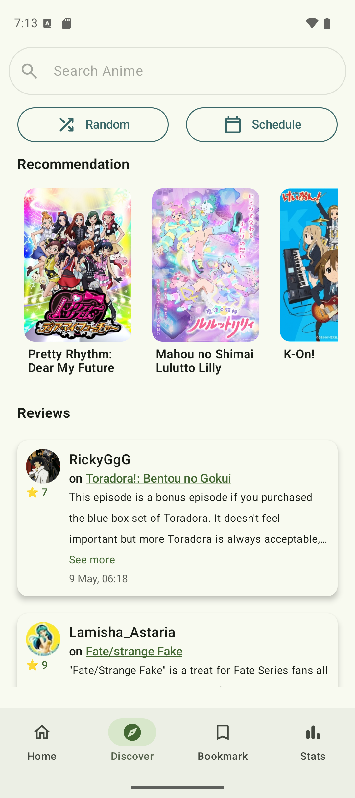
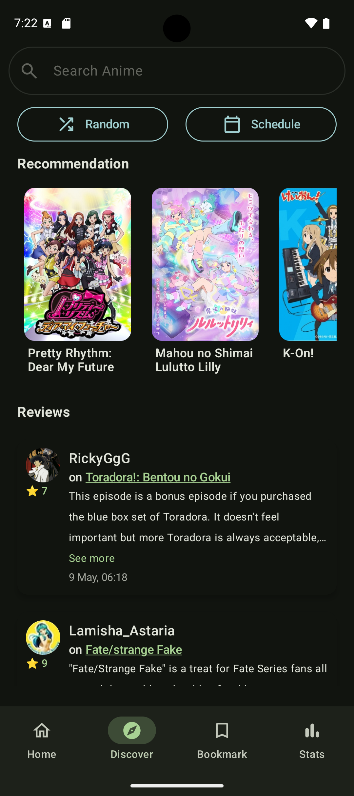
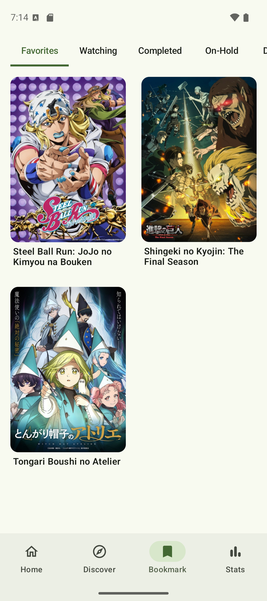
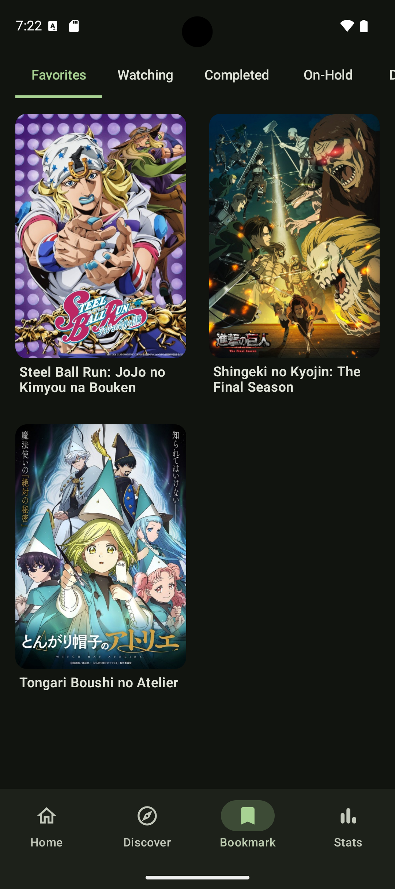
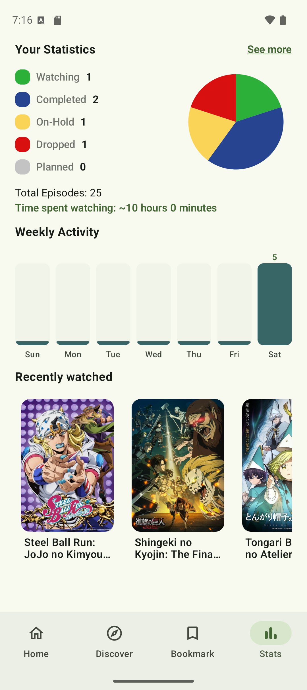
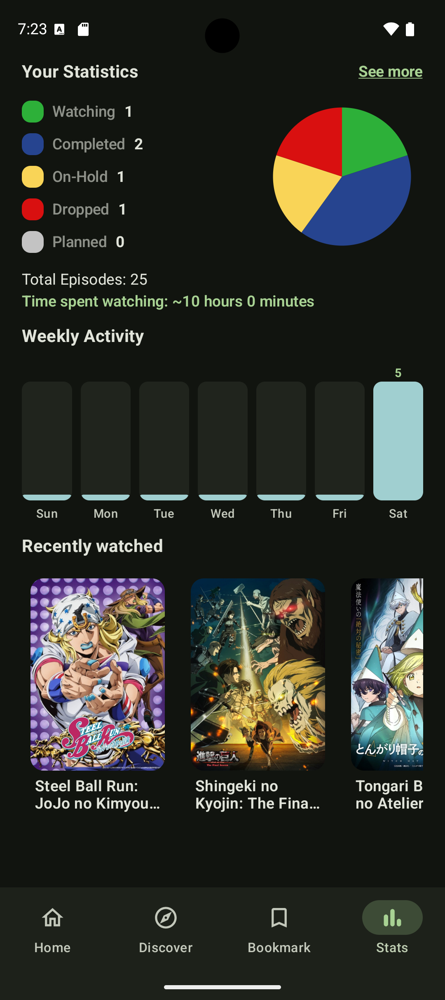
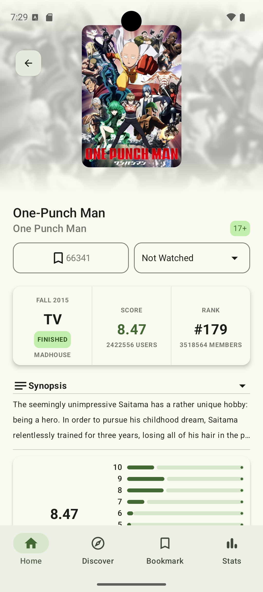
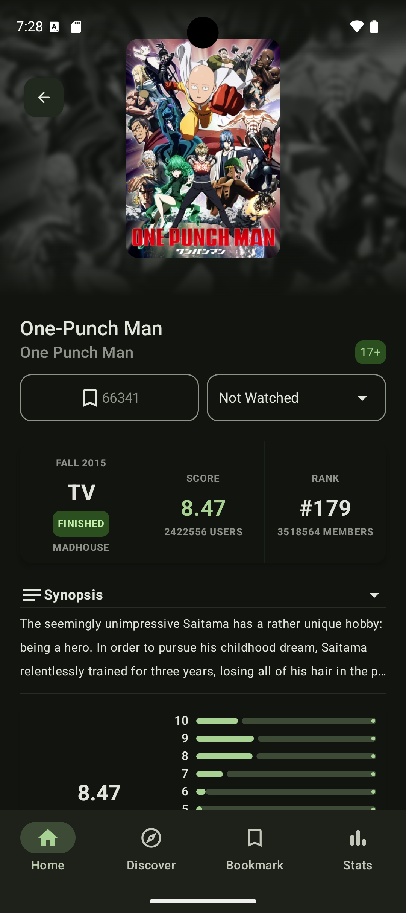

# AnimeList

AnimeList is an Android application for discovering, tracking, and managing anime collections.  
The app is built with Kotlin and Jetpack Compose using modern Android development practices and clean architecture principles.
This project uses the Jikan API.

## Features

### Home
- Ongoing anime list
- Completed anime list
- Upcoming anime list
- Movie anime list

### Discover
- Random anime
- Anime schedule
- Recommendations
- Reviews
- Most popular anime

### Bookmark
User anime library with categories:
- Favourite
- Watching
- Completed
- On-hold
- Dropped
- Planned

### Stats
- Circular statistics chart
- Weekly activity chart
- Recently viewed anime
- Animated graph appearance

### Anime Info
- Detailed anime information
- Add anime to Favourite
- Update watching status

### Search
- Anime search
- Filtering support

## Tech Stack

- Kotlin
- Jetpack Compose
- MVVM Architecture
- Jikan API
- Coroutines
- Flow
- Paging 3
- Room Database
- Hilt Dependency Injection
- Navigation Compose
- Retrofit
- OkHttp
- Coil

---
## Screenshots

### Home
| Light | Dark |
|------|------|
|  |  |

### Discover
| Light | Dark |
|------|------|
|  |  |

### Bookmark
| Light | Dark |
|------|------|
|  |  |

### Stats
| Light | Dark |
|------|------|
|  |  |

### Anime Info
| Light | Dark |
|------|------|
|  |  |
